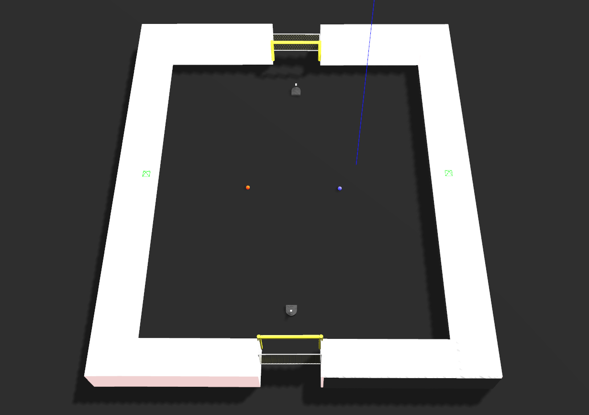
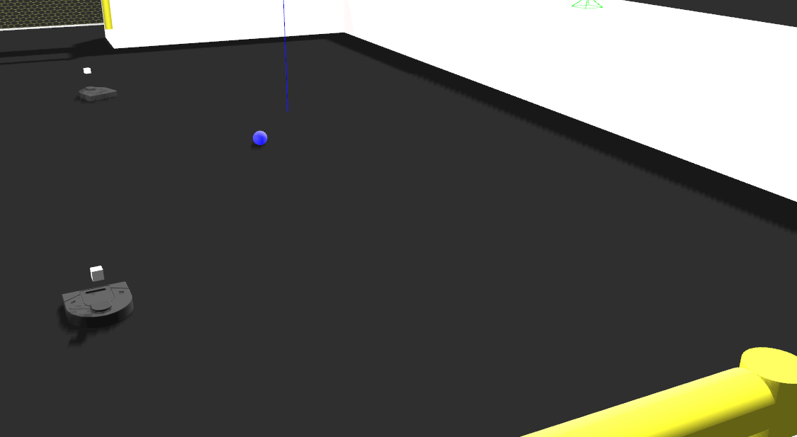

# FA20 Computational Robotics: Computer Vision
*Anusha Datar and Siddharth Garimella*

## Setup

May need to look through launch scripts to fix python version. In either the color-detection or object-recognition folders, run the following:
```
sudo apt-get install ros-<distrib>-gazebo-ros ros-<distrib>-turtlebot
chmod u+x <all scripts>
./launch_world.sh
./launch_teams.sh
```

## Goal
Our original objective was to involve multiple robots and detect features unique to each one, namely faces, on attached signs. We ran into a variety of hurdles implementing this, primarily in manipulating the structure of each neato model towards a non-trivial CV problem, so we split up our project into two modules. 

Our first work uses basic color and contour detection techniques in its application of CV, but involves multiple robots needing to make non-obvious choices about which directions to move in based on this information. We then turned our attention to integrating advanced image detection models into our control of the robot, using Tensorflow to identify specific, real-world objects in Gazebo, and moving a Neato around based on detection output.

## Architecture and Solution

#### Color Recognition
##### Description
The goal of this project was to assign robots respective colors of balls, and line them up to shoot their balls into yellow goals on a field. When balls are not readily directly between a robot and a goal, this mission becomes particularly interesting.

This is the field our robots start in, with two colors of balls.



This is what a successful shot looks like. Note that the robot needs to do some shepherding of the ball to deliver it to the goal.



##### Implementation
There are interesting behaviours required for this mission. The robot first needs to move towards a position from which the ball is lined up with the goal. While in theory, this is rather simple, doing this using vision alone is slightly trickier, as this often means either the goal or both the goal and the ball move out of frame completely, and the robot loses sight of any reference points it may have for its control. 

To resolve this, we first tried two proportional controllers, one to minimize the trigonometric parallax between the ball and the goal, and another to keep the ball and goal in sight just as they're about to move out of frame. This proved quite the tuning problem, so we switched to a heuristic that simply rotates the robot in place to keep the ball and goal in frame after a specific parallax minimum is reached.

This heuristic is how the robot is able to shepherd the ball into the goal, without losing sight of either one.


However, if the correct ball and goal are never visible on the same frame, the mission is failed. Below is an example of what happens after a failed shot on goal. The Neato is unable to recover from such a situation.


## Design Decisions
Describe a design decision you had to make when working on your project and what you ultimately did (and why)? These design decisions could be particular choices for how you implemented some part of an algorithm or perhaps a decision regarding which of two external packages to use in your project.

## Reflection

### Challenges
What if any challenges did you face along the way?

### Further Extensions
- Given more time, we definitely could've combined both sides of our project into a single, interesting application of computer vision and robot movement
- There are a variety of "reset" routines that could be added to our color-detection module, that return the robot to an original, striking position (from which both a ball and the goal are visible) in the event tracking is lost

### Key Takeaways
- While CV is an incredibly powerful tool for robots, unreliable markers can make seemingly simple problems rather complex. This was an issue particularly for taking a non-linear shot on goal, as accomplishing the task sometimes requires losing tracking of the goal.
