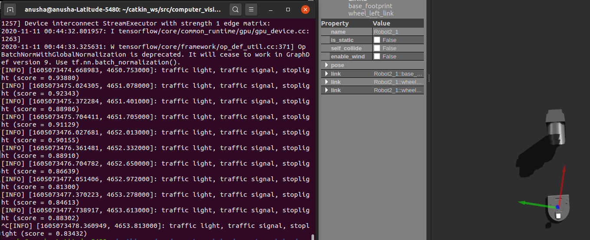
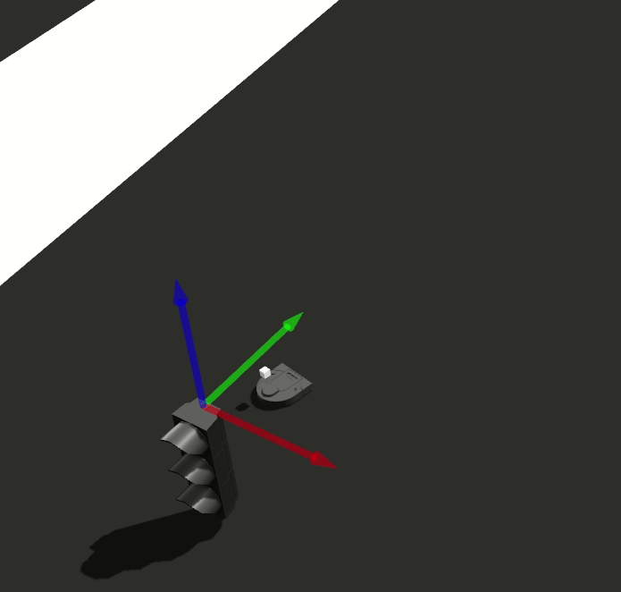

# FA20 Computational Robotics: Computer Vision
*Anusha Datar and Siddharth Garimella*

## Goal
Our original objective was to involve multiple robots and detect features unique to each one, namely faces, on attached signs. We ran into a variety of hurdles implementing this, primarily in manipulating the structure of each neato model towards a non-trivial CV problem, so we split up our project into two modules. 

Our first work uses basic color and contour detection techniques in its application of CV, but involves multiple robots needing to make non-obvious choices about which directions to move in based on this information. We then turned our attention to integrating advanced image detection models into our control of the robot, using Tensorflow to identify specific, real-world objects in Gazebo, and moving a Neato around based on detection output.

For additional description, check out our [slides](https://docs.google.com/presentation/d/1nPLtq9eyAMEVSnmMnp5jCFqk2ZzJbMADbzZNVc6cvLE/edit?usp=sharing) used for a short in-class presentation.

## Setup

In either the color-detection or object-recognition folders, run the following:
```
sudo apt-get install ros-<distrib>-gazebo-ros 
chmod u+x <all scripts>
./launch_world.sh
./launch_teams.sh
```
Note that object-recognition also requires a [tensorflow installation](https://www.tensorflow.org/install).

## Architecture and Solution

#### Color Recognition
##### Description
The goal of this project was to assign robots respective colors of balls, and line them up to shoot their balls into yellow goals on a field. When balls are not readily directly between a robot and a goal, this mission becomes particularly interesting.

This is the field our robots start in, with two colors of balls.


This is what a successful shot looks like. Note that the robot needs to do some shepherding of the ball to deliver it to the goal.


##### Implementation
There are interesting behaviours required for this mission. The robot first needs to move towards a position from which the ball is lined up with the goal. While in theory, this is rather simple, doing this using vision alone is slightly trickier, as this often means either the goal or both the goal and the ball move out of frame completely, and the robot loses sight of any reference points it may have for its control. 

To resolve this, we first tried two proportional controllers, one to minimize the trigonometric parallax between the ball and the goal, and another to keep the ball and goal in sight just as they're about to move out of frame. This proved quite the tuning problem, so we switched to a heuristic that simply rotates the robot in place to keep the ball and goal in frame after a specific parallax minimum is reached.

This heuristic is how the robot is able to shepherd the ball into the goal, without losing sight of either one.


However, if the correct ball and goal are never visible on the same frame, the mission is failed. Below is an example of what happens after a failed shot on goal. The Neato is unable to recover from such a situation.


#### Object Recognition
##### Description
The robot recognizes objects in front of it in the Gazebo world it is located in. If the object in front of it is part of its list of objects to stop for, it stops in front of the object. Otherwise, it continues to move forward.
##### Implementation
The object recognition algorithm uses the Tensorflow implementation of the [Inception model](https://www.tensorflow.org/api_docs/python/tf/keras/applications/InceptionV3) trained on the [ImageNet dataset](http://www.image-net.org/) to classify objects visible in the robot's camera feed. The robot leverages a pre-trained model to quickly classify visible objects and converts the node IDs associated with its conclusions to descriptive strings. 

It then parses the descriptive strings to search for any specified key words to stop for and control the motion of the robot accordingly.



## Design Decisions
The most prominent decision we made was splitting our original objective of feature recognition on the robots themselves up into two very different problems with in two different repositories. This allowed us to maximize our learnings in different areas, with color-detection using a simple CV operation in a complicated way, and object-recognition using a complicated CV operation in a simple way. While we started exploring object detection to understand how to combine these two behaviors, keeping them separate for as long as possible helped us make sure we could continue to develop new features on different aspects of the program even when blocked elsewhere.

We also invested quite a bit of time and energy into exploring different ways to create Gazebo models. While we initially tried to create custom Gazebo models to recognize and manipulate, we realized we were spending more time trying to understand how to create simulated objects in Gazebo than we were learning about computer vision and computational robotics. This further validated our decision to work on components of the project separately and use built-in Gazebo objects as necessary.

## Reflection

### Challenges
- **Simulation and Setup Overhead**: The work associated with setting up Gazebo models and worlds slowed down our pace of work. For example, we spent many hours attempting to create custom Gazebo objects with useful properties (i.e. custom blocks with images on them that had inertial and friction properties such that we could push them like we do with the balls) and often ended up having to correct back to the simplest possible solution. 
- **Gazebo and 3D Space**: It's always interesting flattening problems in three dimensions to a camera feed. Certain mathematical operations seem to become incredibly useful after doing so, in our case, finding the centers of contours and angles of attack to get a shot on goal. That being said, the problems associated with detecting objects in three-dimensional space are a departure from a lot of our previous computer vision experience. 

### Further Extensions
- **Object Detection**: The next step we started exploring towards the end of this project was object detection, where we estimate the location of recognized objects based on their location and size in the frame. From there 
- **Additional Combined Functionality**: Given more time, we definitely could've combined both sides of our project into a single, interesting application of computer vision and robot movement more directly than we do here or than we would with an object detection-centric solution.
- **Reset Routines**: There are a variety of "reset" routines that could be added to our color-detection module, that return the robot to an original, striking position (from which both a ball and the goal are visible) in the event tracking of an object is lost
- **Decreased Scaffolding**: We originally started with using a more direclty created convolutional neural network for image classification, but then we pivoted to using the Inception model because of its increased speed and accuracy. While it does not make sense to reinvent existing algorithms, it could be useful to try augmenting its functionality further than we already do. For example, we could create a Gazebo-specific training set to use alongside the Imagenet data.

### Key Takeaways
- **Computer Vision Challenges**: While CV is an incredibly powerful tool for robots, the presence of very few/unreliable markers can make seemingly simple problems rather complex. This was an issue particularly for taking a non-linear shot on goal, as accomplishing the task sometimes requires losing tracking of the goal.
- **Tooling and Planning**: We spent a lot of time working with Gazebo and Tensorflow instead of with computer vision algorithms. In the future, we can plan our projects such that we can prioritize the learnings we want to invest more time in. We also pivoted multiple times over the course of this project; while this is not necessarily bad, there was a lot of ramp-up overhead and work that did not make it to the final repository. 
